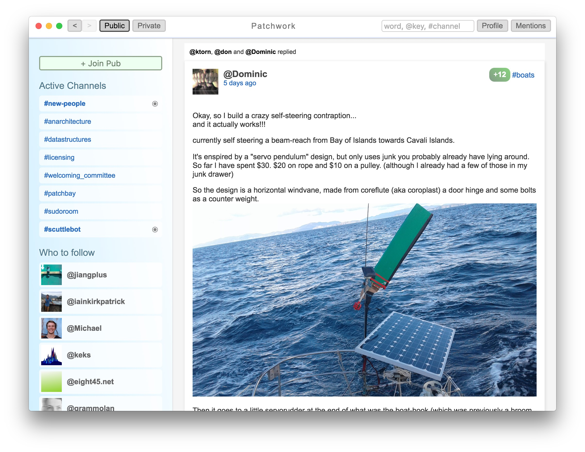

Secure Scuttlebutt - Decentralized Social Network

---

现在我们进行通讯/社交/获取信息的方式：

  * 电子邮件
   - 非常古老，非常通用
   - 作为个人在网上的身份标识
   - 低效的传输协议
   - 大量的spam
   - 非加密的，不安全的，监管机构和黑客经常光顾

---

  * Facebook/Twitter
   - 建构社交网络
   - 网络效应非常强
   - 僵尸粉，spam
   - 被大公司，政府，广告所干预
   - 经常被删帖

---

  * Wechat/Wahtsapp
   - 即时性很强
   - 封闭
   - 个人数据很难管理

---

社交和通讯所面临的一些挑战：

  * 密码作为身份识别手段非常不安全，越来越不安全
  * 政府和监管机构的干预
  * 封闭的网络，私有的协议，私有的软件
  * Spamming
  * 网站被关闭，内容被强制移除，互联网开放性收到威胁

---

一些应对方法：

  * 使用非对称加密的密钥对作为身份标识
  * 加密的传输和储存（https,TLS）
  * 端对端的通讯（WebRTC）
  * 去中心的、开放的网络
  * 可持续升级的协议
  * 使用Bitcoin/Blockchain构建共识和管理资源

---

We need to be decentralized!!

---

Secure Scuttlebutt：

  * 一个开源的，去中心的网络
  * 使用Gossip Protocol共享数据：每个人给每个人共享消息
  * follow关系

---

启发SSB的技术：

  * Twitter 的 follow 关系
  * 分布式数据库的 Gossip Protocol
  * Bitcoin / Blockchain
  * libsodium 的加密算法

---

一些特性：

  * 需要邀请才能够连接
  * pull模式使得spam非常困难
  * 数据端对端加密传输，不依赖特定平台，也无法被政府干预或关闭
  * 匿名性与开放性的平衡
  * 协议升级和扩展的能力
  * 数据不可删除

---

为什么要用 SSB？

 * Public/Private Key 就是你的 ID
 * 非常安全的加密
 * 不可篡改/不可删除
 * 自由的社交网络
 * 不容易被 Spam
 * `off-grid` 即使没有公共网络也可以通讯
 * 替代 Email

---

Patchwork：

  * 基于Secure Scuttlebutt的社交网络
  * 作为一个WebAPP，以及提供多平台客户端
  * 可以follow好友，与好友互动，发送消息
  * 可以分享图片
  * Pub Server作为中继节点

---

Secure Scuttlebutt的一些限制：

  * 单个节点很难管理大量的数据
  * 基于pull模式，很难进行push
  * 时效性弱于即时通讯软件
  * 帐号无法恢复
  * 依赖Gossip Protocol，有一定冗余

---

Links:

 * https://staltz.com/an-off-grid-social-network.html
 * https://github.com/ssbc/patchwork
 * https://ssbc.github.io/scuttlebot/
 * https://github.com/ssbc/patchwork/releases

---

Join a pub!

ssb.piple.in:8008:@bSv6il/f8Llg0S/P59KeTpTdMmAdnKMASai7sX+Hifg=.ed25519~XI++AhntkQT3XyrfH1KWzqaePUMmPuHg0P+t80ngOKU=

---

